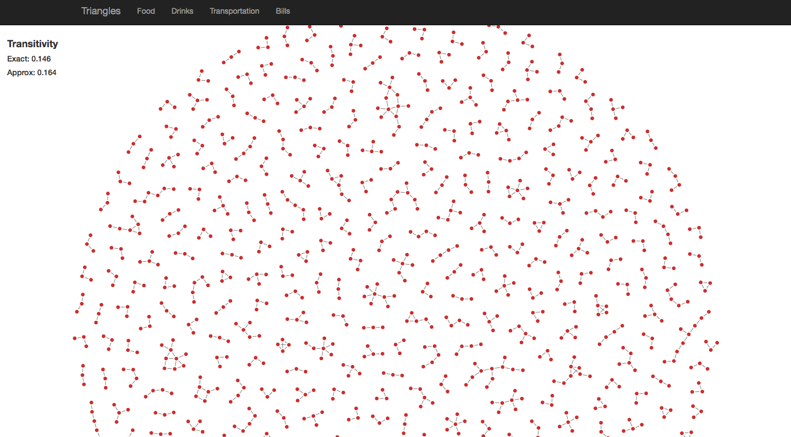
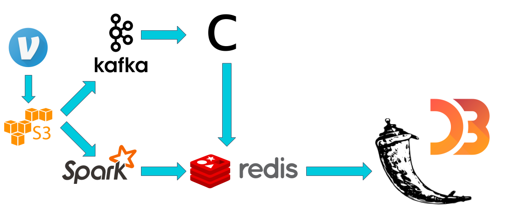

# Table of Contents

1. [Overview](README.md#overview)
2. [Pipeline](README.md#Pipeline)
3. [Directory Structure](README.md#directory-structure)

##Overview
Following is my project for the Insight Data Engineering- Silicon Valley Winter 2017 fellowship.

[Web Application](http://www.anuvedverma.us)

[Project Slides](http://www.slideshare.net/AnuvedVerma/triangles-71987416)

[Demo Video]()

In this project, I implemented a data pipeline to analyze a stream of Venmo payments. I was particularly interested in studying what types of transactions were most responsible for forming 'cliques'. The cliqueness, or clustering, of the Venmo social network can be quantified by calculating its <i>transitivity</i>. Transitivity is a measure for quantifying the level of clustering in graphs, and is calculated by counting the ratio of triangles (cycles of length 3) to wedges (paths of length 2).

Determining exact transitivity is an O(~n3) calculation, and is impractical for large graphs. Furthermore, measuring transitivity from a stream of edges introduces another level of complexity to the problem.

My solution for this problem was to implement a one-pass streaming transitivity approximation algorithm outlined by [Jha et al. 2013](https://arxiv.org/abs/1212.2264). The algorithm works by maintaining a random sample of wedges from the stream, and returning the fraction of the wedges that are "closed" by each incoming edge to form a triangle. To verify performance of the approximation algorithm, I compared its results with the exact transitivity calculated on a smaller sample of Venmo transactions. Finally, I also calculated some global statistics on counts and transitivity of transaction types across the whole Venmo community.

Initially, my implementation of the streaming transitivity algorithm returned extremely poor approximations-- up to almost 20% difference from the actual transitivity. This is because the algorithm as described by Jha et al. 2013 does not account for repeating edges, which is a frequent occurrence with Venmo transactions (multiple food-related transactions may happen between the same two users). The circumvent this, I used a Scalable Bloom Filter to track and ignore repeated edges, which yielded much better results.

##Pipeline

Historical Venmo data is stored on Amazon S3, which I used for batch processes as well as simulated streams. 

For the batch part of the pipeline, I used Spark to process the data into colored edges, which were then stored on Redis. On the streaming side, I emulated a stream by from S3 into Kafka, then processed the transactions with my Kafka Consumer. The results were also stored on Redis. My Flask application then queried the Redis database for the relevant data.

##Repository Structure

- `./src/` contains all relevant files for replicating the batch and streaming portions of the project

- `./webapps/` contains the relevant files for the Flask web application

- `./sample-data` contains some sample Venmo transaction data

- `./config` contains configurations for setting up AWS clusters using [Pegasus](https://github.com/InsightDataScience/pegasus)

- `./dev-scripts` contains other in-progress scripts I wrote during the project, but aren't part of the final project (messing around with different databases, trying out Spark Streaming, etc.); potentially handy for future use 