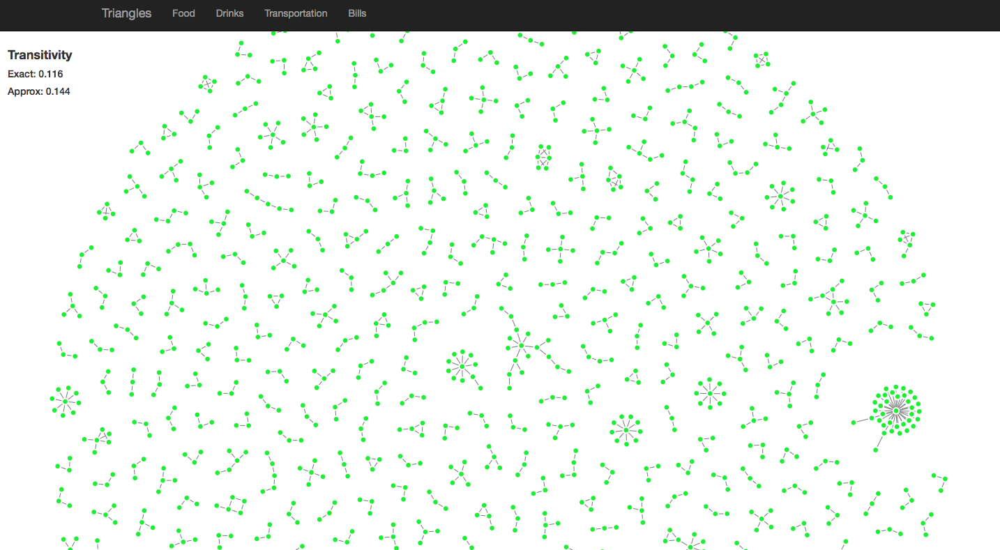
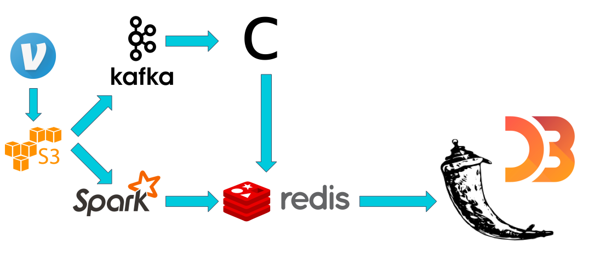

# Table of Contents

1. [Overview] (README.md#overview)
2. [Instructions] (README.md#instructions)
3. [Description of Data] (README.md#description-of-data)
4. [Unit Tests] (README.md#unit-tests)
5. [Directory Structure] (README.md#directory-structure)

##Overview
Following is my project for the Insight Data Engineering- Silicon Valley Winter 2017 fellowship.

Project Slides: [Insert link here]
Demo Video: [Insert link here]

In this project, I implemented a data pipeline to analyze a stream of Venmo payments. I was particularly interested in studying what types of transactions were most responsible for forming 'cliques'. The cliqueness, or clustering, of the Venmo social network can be quantified by calculating its <i>transitivity</i>. Transitivity is a measure for quantifying the level of clustering in graphs, and is calculated by counting the ratio of triangles (cycles of length 3) to wedges (paths of length 2).
Determining exact transitivity is an O(n^3) calculation, and is impractical for large graphs. Furthermore, measuring transitivity from a stream of edges introduces another level of complexity to the problem.

My solution for this problem was to implement a one-pass streaming transitivity approximation algorithm outlined by Jha et al. 2013 [Insert link here]. The algorithm works by maintaining a random sample of wedges from the stream, and returning the fraction of the wedges that are "closed" by each incoming edge to form a triangle. To verify performance of the approximation algorithm, I also compared its results with the exact transitivity calculated on a smaller sample of Venmo transactions. Finally, I also calculated some global statistics on transaction types of the whole Venmo community.
Initially, my implementation of the streaming transitivity algorithm returned extremely poor approximations-- up to almost 20% difference from the actual transitivity. This is because the algorithm as described by Jha et al. 2013 does not account for repeating edges, which is a frequent occurrence with Venmo transactions (multiple food-related transactions may happen between the same two users). The circumvent this, I used a Scalable Bloom Filter to track and ignore repeated edges, which yielded much better results.

##Pipeline

Historical Venmo data is stored on Amazon S3, which I used for batch processes as well as simulated streams. For the batch part of the pipeline, I used Spark to process the data into colored edges, which were then stored on Redis. On the streaming side, I emulated a stream by from S3 into Kafka, then processed the transactions with my Kafka Consumer. The results were also stored on Redis. My Flask application then queried the Redis database for the relevant data.

##Directory Structure
[Back to Table of Contents] (README.md#table-of-contents)

The directory structure must be as shown below for the test scripts to run, as must the format of the output data in `output1.txt`, `output2.txt` and `output3.txt`. 
Use the test script called `run_tests.sh` in the `insight_testsuite` folder to test for the basic 3 features, and `run_tests2.sh` to test for the basic features + Feature 4.

The tests are stored simply as text files under the `insight_testsuite/tests` folder. Each test must have a separate folder and each must contain a `paymo_input` folder -- where `batch_payment.txt` and `stream_payment.txt` files can be found. 
There also should be a `paymo_output` folder where the correct `output1.txt`, `output2.txt` and `output3.txt` must reside (as well as `output4.txt if testing Feature 4).

From the `insight_testsuite` folder, you can run the test with the following command:

	insight_testsuite$ ./run_tests.sh 

The output of `run_tests.sh` should look like:

    [PASS]: test-2-paymo-trans (output1.txt)
    [FAIL]: test-2-paymo-trans (output2.txt)
    1c1
    < trusted
    ---
    > unverified
    [PASS]: test-2-paymo-trans (output3.txt
    [Fri Nov  4 13:20:25 PDT 2016] 2 of 3 tests passed

on failed tests and	
	
	[PASS]: test-1-paymo-trans (output1.txt)
	[PASS]: test-1-paymo-trans (output2.txt)
	[PASS]: test-1-paymo-trans (output3.txt)
	[Fri Nov  4 13:20:25 PDT 2016] 3 of 3 tests passed
on success.

Repo Structure:

	├── README.md 
	├── run.sh
	├── src
	│  	└── *.java
	├── paymo_input
	│   └── batch_payment.txt
	|   └── stream_payment.txt
	├── paymo_output
	│   └── output1.txt
	|   └── output2.txt
	|   └── output3.txt
	└── insight_testsuite
	 	   ├── run_tests.sh
		   └── tests
	        	└── test-1-paymo-trans
        		│   ├── paymo_input
        		│   │   └── batch_payment.txt
        		│   │   └── stream_payment.txt
        		│   └── paymo_output
        		│       └── output1.txt
        		│       └── output2.txt
        		...      └── output3.txt
        		│               
        		└── test-10-paymo-trans
            		 ├── paymo_input
        		     │   └── batch_payment.txt
        		     │   └── stream_payment.txt
        		     └── paymo_output
        		         └── output1.txt
        		         └── output2.txt
        		         └── output3.txt
